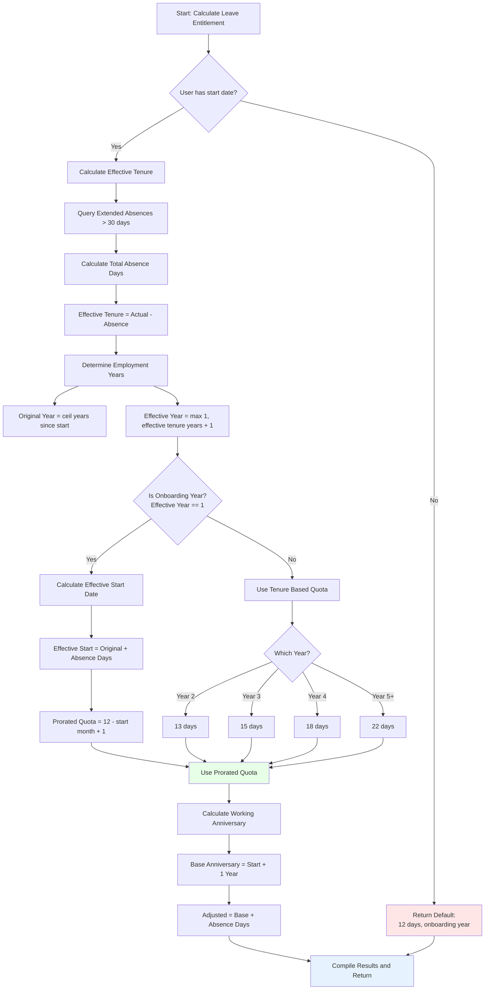

This comprehensive leave balance system provides accurate, real-time calculations that integrate seamlessly with the existing dynamic tenure calculation approach.

## Combined Logic: Prorate + Working Anniversaries + Extended Absences

### Overview

This section explains how the system combines three critical components to calculate accurate leave entitlements:

1. **Prorated Leave Calculation** (onboarding year employees)
2. **Working Anniversary Calculation** (adjusted by extended absences)
3. **Effective Tenure Impact** (how absences affect anniversary dates)

### Logic Overview

The complete leave entitlement calculation follows this clear sequence:

#### **Decision Tree Logic**

```
1. GET user data
   ├─ IF no start_date found
   │  └─ RETURN default quota (12 days, first year)
   │
   └─ ELSE continue with calculations

2. CALCULATE effective tenure
   ├─ Query extended absences > 30 days
   ├─ Calculate total absence days
   └─ Effective tenure = actual time - absence days

3. DETERMINE employment year status
   ├─ Original employment year = ceil(years since start)
   ├─ Effective employment year = max(1, effective_tenure.years + 1)
   └─ Is onboarding year = (effective employment year == 1)

4. CALCULATE working anniversary
   ├─ Base anniversary = start_date + 1 year
   └─ Adjusted anniversary = base + total absence days

5. DETERMINE quota based on year status
   ├─ IF onboarding year (effective employment year = 1)
   │  ├─ Calculate effective start date = original + absence days
   │  ├─ Prorated quota = 12 - effective_start_month + 1
   │  └─ Use prorated quota (partial year entitlement)
   │
   └─ ELSE (regular employment year 2+)
      └─ Use tenure-based quota (13, 15, 18, or 22 days)

6. COMPILE results
   └─ Return all calculated values + absence impact analysis
```

#### **Key Formulas**

| Calculation | Formula | Example |
|-------------|---------|---------|
| **Year of Employment** | `ceil(years_since_start)` | Start Jan 2023 → 2024 = Year 2 |
| **Effective Tenure** | `actual_days - absence_days_over_30` | 400 days - 60 absence = 340 days |
| **Prorated Quota** | `12 - effective_start_month + 1` | Start June → 12 - 6 + 1 = 7 days |
| **Working Anniversary** | `start_date + 1_year + absence_days` | Jan 1 + 1yr + 90 days = Apr 1 |
| **Tenure-Based Quota** | `Map[employment_year]` | Year 3 → 15 days |

#### **Business Rules Applied**

1. **30-Day Threshold**: Only count absences > 30 consecutive days
2. **Cumulative Absences**: Multiple qualifying absences add up
3. **Proration Logic**: Onboarding year uses month-based calculation
4. **Anniversary Delay**: Working anniversary shifts by absence duration
5. **Minimum Quota**: Always at least 1 day (safety floor)
6. **Default Fallback**: 12 days if no start date exists

#### **Visual Flow Diagram**



#### **Quick Reference Logic Table**

| Condition | Action | Result | Example |
|-----------|--------|--------|---------|
| **No start date** | Use default | 12 days | New user, no setup |
| **Onboarding year + No absences** | Prorate by month | `12 - start_month + 1` | June start = 7 days |
| **Onboarding year + Extended absence** | Prorate by effective start | `12 - effective_month + 1` | June start + 60 days absence = 4 days |
| **Second year** | Full quota | 13 days | Completed 1 effective year |
| **Third year** | Full quota | 15 days | Completed 2 effective years |
| **Fourth year** | Full quota | 18 days | Completed 3 effective years |
| **Fifth+ year** | Full quota | 22 days | Completed 4+ effective years |
| **Absence ≤ 30 days** | Ignore | No impact | 25-day sick leave |
| **Absence > 30 days** | Delay anniversary | Days added to anniversary | 60-day maternity leave |
| **Multiple absences** | Cumulative effect | All qualifying absences sum | 40 + 35 = 75 days delay |

### The Complete Calculation Flow

```typescript
export async function calculateCompleteLeaveEntitlement(
  userId: string,
  targetDate: Date = new Date()
): Promise<{
  originalStartDate: string | null;
  effectiveStartDate: string | null;
  workingAnniversary: string | null;
  employmentYear: number;
  effectiveEmploymentYear: number;
  isOnboardingYear: boolean;
  totalQuota: number;
  proratedQuota?: number;
  extendedAbsenceImpact: {
    totalAbsenceDays: number;
    anniversaryDelay: number;
    tenureReduction: string;
  };
}> {
  const supabase = await createServerClient();
  
  // Get user details
  const { data: user } = await supabase
    .from("users")
    .select("start_date")
    .eq("id", userId)
    .single();
  
  if (!user?.start_date) {
    // If no start date is set, default to 12 days (onboarding year quota)
    return {
      originalStartDate: null,
      effectiveStartDate: null,
      workingAnniversary: null,
      employmentYear: 1,
      effectiveEmploymentYear: 1,
      isOnboardingYear: true,
      totalQuota: 12,
      proratedQuota: 12,
      extendedAbsenceImpact: {
        totalAbsenceDays: 0,
        anniversaryDelay: 0,
        tenureReduction: '0 days'
      }
    };
  }
  
  const originalStartDate = user.start_date;
  
  // Step 1: Calculate effective tenure (considering extended absences)
  const effectiveTenure = await calculateEffectiveTenure(
    originalStartDate,
    userId,
    targetDate
  );
  
  // Step 2: Calculate working anniversary (adjusted for absences)
  const workingAnniversary = calculateWorkingAnniversary(
    originalStartDate,
    effectiveTenure
  );
  
  // Step 3: Determine employment years (original vs effective)
  const originalEmploymentYear = yearOfEmployment(originalStartDate, targetDate);
  const effectiveEmploymentYear = Math.max(1, effectiveTenure.years + 1);
  
  // Step 4: Check if still in onboarding year (considering absences)
  const isOnboardingYear = effectiveEmploymentYear === 1;
  
  // Step 5: Calculate base quota
  let totalQuota: number;
  let proratedQuota: number | undefined;
  
  if (isOnboardingYear) {
    // Onboarding year: Use prorated calculation based on EFFECTIVE start
    const effectiveStartDate = calculateEffectiveStartDate(originalStartDate, effectiveTenure);
    proratedQuota = calculateProratedOnboardingYearQuota(effectiveStartDate, targetDate);
    totalQuota = proratedQuota;
  } else {
    // Regular year: Use tenure-based quota
    totalQuota = totalAnnualLeaveDays(effectiveEmploymentYear);
  }
  
  // Step 6: Calculate absence impact summary
  const absenceImpact = await calculateAbsenceImpact(userId, originalStartDate, targetDate);
  
  return {
    originalStartDate,
    effectiveStartDate: calculateEffectiveStartDate(originalStartDate, effectiveTenure),
    workingAnniversary,
    employmentYear: originalEmploymentYear,
    effectiveEmploymentYear,
    isOnboardingYear,
    totalQuota,
    proratedQuota,
    extendedAbsenceImpact: absenceImpact
  };
}
```

### Step-by-Step Breakdown

#### **Step 1: Calculate Effective Tenure**

```typescript
// This function already exists in your system
const effectiveTenure = await calculateEffectiveTenure(
  originalStartDate,
  userId,
  targetDate
);
// Returns: { years: 1, months: 8, days: 15 } (example)
```

#### **Step 2: Working Anniversary Calculation**

```typescript
function calculateWorkingAnniversary(
  originalStartDate: string,
  effectiveTenure: { years: number; months: number; days: number }
): string {
  const start = new Date(originalStartDate);
  
  // Add effective tenure to original start date
  const anniversary = new Date(start);
  anniversary.setFullYear(start.getFullYear() + effectiveTenure.years);
  anniversary.setMonth(start.getMonth() + effectiveTenure.months);
  anniversary.setDate(start.getDate() + effectiveTenure.days);
  
  // The working anniversary is when they complete their first effective year
  const workingAnniversary = new Date(start);
  workingAnniversary.setFullYear(start.getFullYear() + 1);
  
  // Add the total absence days that affected tenure
  const totalAbsenceDays = (365 * effectiveTenure.years + 30 * effectiveTenure.months + effectiveTenure.days) - 
                          Math.floor((new Date().getTime() - start.getTime()) / (1000 * 60 * 60 * 24));
  
  if (totalAbsenceDays > 0) {
    workingAnniversary.setDate(workingAnniversary.getDate() + totalAbsenceDays);
  }
  
  return workingAnniversary.toISOString().split('T')[0];
}
```

#### **Step 3: Effective Start Date for Proration**

```typescript
function calculateEffectiveStartDate(
  originalStartDate: string,
  effectiveTenure: { years: number; months: number; days: number }
): string {
  const original = new Date(originalStartDate);
  const now = new Date();
  
  // Calculate how many actual days have passed
  const actualDays = Math.floor((now.getTime() - original.getTime()) / (1000 * 60 * 60 * 24));
  
  // Calculate effective days (considering absences)
  const effectiveDays = effectiveTenure.years * 365 + effectiveTenure.months * 30 + effectiveTenure.days;
  
  // The difference is the total absence days
  const absenceDays = actualDays - effectiveDays;
  
  // Effective start date is original start plus absence days
  const effectiveStart = new Date(original);
  effectiveStart.setDate(effectiveStart.getDate() + absenceDays);
  
  return effectiveStart.toISOString().split('T')[0];
}
```

#### **Step 4: Prorated Onboarding Year Calculation (Absence-Adjusted)**

```typescript
function calculateProratedOnboardingYearQuota(
  effectiveStartDate: string,
  targetDate: Date
): number {
  const effectiveStart = new Date(effectiveStartDate);
  const target = new Date(targetDate);
  
  // Use the effective start month for proration
  const effectiveStartMonth = effectiveStart.getMonth() + 1;
  
  // If we're still in the same calendar year
  if (effectiveStart.getFullYear() === target.getFullYear()) {
    return Math.max(1, 12 - effectiveStartMonth + 1);
  }
  
  // If we've crossed into the next year, check if still in first effective year
  const effectiveMonthsWorked = (target.getFullYear() - effectiveStart.getFullYear()) * 12 + 
                               (target.getMonth() - effectiveStart.getMonth());
  
  if (effectiveMonthsWorked < 12) {
    // Still in onboarding year, calculate remaining months
    return Math.max(1, 12 - effectiveStartMonth + 1);
  }
  
  // Completed onboarding year, move to regular calculation
  return totalAnnualLeaveDays(2); // Second year quota
}
```

#### **Step 5: Absence Impact Analysis**

```typescript
async function calculateAbsenceImpact(
  userId: string,
  originalStartDate: string,
  targetDate: Date
): Promise<{
  totalAbsenceDays: number;
  anniversaryDelay: number;
  tenureReduction: string;
}> {
  const supabase = await createServerClient();
  
  // Get all extended absences
  const { data: absences } = await supabase
    .from("extended_absences")
    .select("*")
    .eq("user_id", userId)
    .lte("end_date", targetDate.toISOString().split('T')[0]);
  
  let totalAbsenceDays = 0;
  
  if (absences) {
    for (const absence of absences) {
      const absenceStart = new Date(absence.start_date);
      const absenceEnd = new Date(absence.end_date);
      const serviceStart = new Date(originalStartDate);
      
      // Calculate overlap with service period
      const overlapStart = new Date(Math.max(absenceStart.getTime(), serviceStart.getTime()));
      const overlapEnd = new Date(Math.min(absenceEnd.getTime(), targetDate.getTime()));
      
      if (overlapStart <= overlapEnd) {
        const overlapDays = Math.ceil((overlapEnd.getTime() - overlapStart.getTime()) / (1000 * 60 * 60 * 24)) + 1;
        
        // Only count absences longer than 30 days
        if (overlapDays > 30) {
          totalAbsenceDays += overlapDays;
        }
      }
    }
  }
  
  const anniversaryDelay = totalAbsenceDays;
  const tenureReduction = formatDuration(totalAbsenceDays);
  
  return {
    totalAbsenceDays,
    anniversaryDelay,
    tenureReduction
  };
}

function formatDuration(days: number): string {
  const years = Math.floor(days / 365);
  const months = Math.floor((days % 365) / 30);
  const remainingDays = days % 30;
  
  const parts = [];
  if (years > 0) parts.push(`${years} year${years > 1 ? 's' : ''}`);
  if (months > 0) parts.push(`${months} month${months > 1 ? 's' : ''}`);
  if (remainingDays > 0) parts.push(`${remainingDays} day${remainingDays > 1 ? 's' : ''}`);
  
  return parts.join(', ') || '0 days';
}
```

### Comprehensive Examples

#### **Example 1: Onboarding Year Employee with Extended Absence**

```
Employee Details:
- Original Start Date: June 1, 2023
- Extended Absence: August 1, 2023 to November 15, 2023 (106 days)
- Current Date: May 1, 2024

Step-by-Step Calculation:

1. Original Employment Year: 1 (onboarding year)
2. Extended Absence Impact: 106 days (> 30, affects tenure)
3. Effective Tenure: 
   - Actual days worked: 334 days
   - Minus absence: 334 - 106 = 228 days
   - Effective tenure: ~7.6 months

4. Working Anniversary Calculation:
   - Original: June 1, 2024
   - Delayed by: 106 days
   - New working anniversary: September 15, 2024

5. Still in Onboarding Year: Yes (effective tenure < 1 year)

6. Prorated Quota Calculation:
   - Effective start: June 1, 2023 + 106 days = September 15, 2023
   - Effective start month: September (month 9)
   - Prorated quota: 12 - 9 + 1 = 4 days

Result: Employee gets 4 days leave quota (heavily reduced due to absence)
```

#### **Example 2: Employee Crossing to Second Year with Absence**

```
Employee Details:
- Original Start Date: March 1, 2023
- Extended Absence: October 1, 2023 to December 31, 2023 (92 days)
- Current Date: June 1, 2024

Step-by-Step Calculation:

1. Original Employment Year: 2 (second year)
2. Extended Absence Impact: 92 days (> 30, affects tenure)
3. Effective Tenure: 
   - Total time: 457 days
   - Minus absence: 457 - 92 = 365 days
   - Effective tenure: Exactly 1 year

4. Working Anniversary:
   - Original: March 1, 2024
   - Delayed by: 92 days
   - New working anniversary: June 1, 2024

5. Employment Year Status: Just completed onboarding year
6. Quota: Transitions from prorated (onboarding year) to full second year quota

Result: Employee gets 13 days (second year quota) starting June 1, 2024
```

#### **Example 3: Multiple Absences Affecting Tenure**

```
Employee Details:
- Original Start Date: January 1, 2023
- Extended Absence 1: April 1-June 30, 2023 (91 days)
- Extended Absence 2: September 1-October 15, 2023 (45 days)
- Current Date: March 1, 2024

Step-by-Step Calculation:

1. Total Absence Days: 91 + 45 = 136 days
2. Effective Tenure:
   - Total time: 425 days
   - Minus absences: 425 - 136 = 289 days
   - Effective tenure: ~9.6 months

3. Working Anniversary:
   - Original: January 1, 2024
   - Delayed by: 136 days
   - New working anniversary: May 16, 2024

4. Still in Onboarding Year: Yes (effective tenure < 1 year)
5. Prorated Quota: Based on multiple absence impact

Result: Employee still in onboarding year, working anniversary delayed significantly
```

#### **Example 4: Employee with No Start Date Set**

```
Employee Details:
- Original Start Date: null (not set in system)
- Extended Absences: None (cannot calculate without start date)
- Current Date: Any date

Step-by-Step Calculation:

1. Start Date Check: No start date found
2. Default Behavior: Return default onboarding year quota
3. Employment Year: 1 (default)
4. Quota: 12 days (standard onboarding year entitlement)
5. No Anniversary Calculation: Cannot determine without start date
6. No Absence Impact: Cannot calculate without employment period

Result: Employee gets default 12 days quota (safe fallback)
```

### Integration with Dashboard

```typescript
// Enhanced leave balance component
export function EnhancedLeaveBalanceSection({ userId }: { userId: string }) {
  const [entitlement, setEntitlement] = useState<CompleteLeaveEntitlement | null>(null);
  
  useEffect(() => {
    async function fetchEntitlement() {
      const result = await calculateCompleteLeaveEntitlement(userId);
      setEntitlement(result);
    }
    fetchEntitlement();
  }, [userId]);
  
  if (!entitlement) return <LoadingSpinner />;
  
  return (
    <Card>
      <CardHeader>
        <CardTitle>Complete Leave Entitlement Analysis</CardTitle>
      </CardHeader>
      <CardContent className="space-y-6">
        {/* Basic Info */}
        <div className="grid grid-cols-2 gap-4">
          <div>
            <p className="text-sm text-muted-foreground">Original Start Date</p>
            <p className="font-medium">
              {entitlement.originalStartDate ? formatDate(entitlement.originalStartDate) : "Not set"}
            </p>
            {!entitlement.originalStartDate && (
              <p className="text-xs text-yellow-600">Using default quota</p>
            )}
          </div>
          <div>
            <p className="text-sm text-muted-foreground">Working Anniversary</p>
            <p className="font-medium">
              {entitlement.workingAnniversary ? formatDate(entitlement.workingAnniversary) : "Cannot calculate"}
            </p>
            {entitlement.extendedAbsenceImpact.anniversaryDelay > 0 && (
              <p className="text-xs text-orange-600">
                Delayed by {entitlement.extendedAbsenceImpact.anniversaryDelay} days
              </p>
            )}
          </div>
        </div>
        
        {/* Employment Year Status */}
        <div className="p-4 bg-muted rounded-lg">
          <div className="flex justify-between items-center">
            <div>
              <p className="font-medium">Employment Year Status</p>
              <p className="text-sm text-muted-foreground">
                {entitlement.isOnboardingYear ? "Onboarding Year (Prorated)" : `Year ${entitlement.effectiveEmploymentYear}`}
              </p>
            </div>
            <div className="text-right">
              <p className="text-2xl font-bold">{entitlement.totalQuota} days</p>
              {entitlement.proratedQuota && (
                <p className="text-xs text-blue-600">Prorated from 12 days</p>
              )}
            </div>
          </div>
        </div>
        
        {/* Extended Absence Impact */}
        {entitlement.extendedAbsenceImpact.totalAbsenceDays > 0 && (
          <div className="p-4 border-l-4 border-orange-500 bg-orange-50">
            <h4 className="font-medium text-orange-800">Extended Absence Impact</h4>
            <div className="mt-2 space-y-1 text-sm text-orange-700">
              <p>Total absence days: {entitlement.extendedAbsenceImpact.totalAbsenceDays}</p>
              <p>Tenure reduction: {entitlement.extendedAbsenceImpact.tenureReduction}</p>
              <p>Anniversary delay: {entitlement.extendedAbsenceImpact.anniversaryDelay} days</p>
            </div>
          </div>
        )}
        
        {/* Effective vs Original Comparison */}
        <div className="grid grid-cols-2 gap-4 text-sm">
          <div>
            <p className="text-muted-foreground">Original Employment Year</p>
            <p className="font-medium">Year {entitlement.employmentYear}</p>
          </div>
          <div>
            <p className="text-muted-foreground">Effective Employment Year</p>
            <p className="font-medium">Year {entitlement.effectiveEmploymentYear}</p>
            {entitlement.employmentYear !== entitlement.effectiveEmploymentYear && (
              <p className="text-xs text-orange-600">Adjusted for absences</p>
            )}
          </div>
        </div>
      </CardContent>
    </Card>
  );
}
```

### Business Rules Summary

1. **30-Day Threshold**: Only absences > 30 days affect tenure and anniversary
2. **Cumulative Effect**: Multiple absences accumulate to delay anniversary
3. **Prorated Adjustment**: Onboarding year quota adjusts based on effective start date
4. **Anniversary Delay**: Working anniversary shifts by total absence days
5. **Real-time Calculation**: All calculations update immediately when absences change
6. **Default Quota Fallback**: If no start date is set, default to 12 days (onboarding year quota)

This integrated system ensures accurate leave entitlements that properly account for extended absences while maintaining fair proration for onboarding year employees.
